<div align="center">

<!-- animated cyberpunk banner -->


<!-- animated typing -->


<br/>

<!-- social badges -->

<a href="https://github.com/paybackretr0"></a>
<a href="https://www.linkedin.com/in/khaliedmtrn"></a>
<a href="https://www.instagram.com/khaliedmtrn"></a>
<a href="mailto:khalidmaturino@gmail.com"></a>
<a href="https://khalied.maturino.my.id"></a>

</div>

<br/>

```text
┌────────────────────────────────────────────────────────────┐
│  SYS.INIT: KHALIED NAULY MATURINO                          │
│  ROLE: SOFTWARE DEVELOPER                                  │
│  FOCUS: MOBILE · WEB · INFORMATION SYSTEMS                 │
│  LOCATION: PADANG, INDONESIA                               │
│  EDU: S1 SISTEM INFORMASI — UNIVERSITAS ANDALAS (3.76/4.00)│
│  STATUS: OPEN TO INTERNSHIPS · COLLABORATION · PROJECTS     │
└────────────────────────────────────────────────────────────┘
```

## ⚡ About Me

- 🎓 **Final-year S1 Information Systems** at **Universitas Andalas** — GPA **3.76 / 4.00**, graduating **Sept 2026**.
- 💻 Software Developer building **mobile apps (Android · Flutter)** and **web information systems (Laravel · React)**.
- 🏛️ Hands-on experience shipping **campus & government digitalization projects** — DPMPTSP Padang, IT Directorate UNAND.
- 🏆 Hackathon medalist — **2nd Place Impact National Hackathon**, **3rd Place National Cybertech Hackathon**, **Gold Medal — Mahasiswa Berdampak Seminar**.
- 🎓 **Bangkit Academy 2024** alumni (Google-backed Android program).
- 🚀 Published a production Android app on the **Google Play Store** — _ExcaMotion_.
- ⚙️ Currently leveling up: **Clean Architecture**, **System Design**, **DevOps**.

---

## 🛸 Tech Stack

<div align="center">

**Languages**


**Frontend**


**Backend**


**Mobile**


**Database & DevOps**


**Tools**


</div>

> 📌 _Also working with: Jetpack Compose · Room · Ant Design · Sequelize ORM · RESTful API · MVC / MVVM / Clean Architecture_

---

## 🧬 GitHub Pulse

<div align="center">


<br/>


<br/>


<br/>


<!-- Cadangan jika trophy di atas mati (pilih salah satu):
  https://trophy.benkou.dev/?username=paybackretr0&theme=onestar&no-frame=true&no-bg=true&margin-w=6&margin-h=6&column=7
  https://github-trophies.devomb.com/?username=paybackretr0&theme=onestar&no-frame=true&no-bg=true&margin-w=6&margin-h=6&column=7
  https://github-profile-trophy-unserori.vercel.app/?username=paybackretr0&theme=onestar&no-frame=true&no-bg=true&margin-w=6&margin-h=6&column=7
  https://github-profile-trophy-orcin-eta.vercel.app/?username=paybackretr0&theme=onestar&no-frame=true&no-bg=true&margin-w=6&margin-h=6&column=7
-->

</div>

---

## 🐍 Contribution Snake

<div align="center">

<!-- Generated daily by the snake.yml workflow — see instructions below -->
<picture>
  <source media="(prefers-color-scheme: dark)" srcset="https://raw.githubusercontent.com/paybackretr0/paybackretr0/output/github-snake-dark.svg" />
  <source media="(prefers-color-scheme: light)" srcset="https://raw.githubusercontent.com/paybackretr0/paybackretr0/output/github-snake.svg" />
  
</picture>

</div>

---

## 🚀 Highlight Projects

| Project                                 | Description                                                                                              | Stack                           |
| :-------------------------------------- | :------------------------------------------------------------------------------------------------------- | :------------------------------ |
| **BSS Management System — UNAND**       | Digitalized student temporary-leave flow: online submission, multi-step verification & official letters. | Laravel · MySQL · Docker        |
| **Non-APBN Scholarship System — UNAND** | Scholarship registration, document validation & selection with admin dashboard.                          | React · Express · Redis · MySQL |
| **TeleMetri App + Admin Dashboard**     | Organization attendance with dynamic QR + geofencing/GPS, plus a web admin portal.                       | Flutter · Laravel · MySQL       |
| **ACEED EXPO Unand 2025**               | Job-fair platform: participant registration, vacancy publication & schedule management.                  | Laravel · MySQL                 |
| **ExcaMotion**                          | Real-time excavator cycle analysis (Dig/Load/Swing/Dump) — **published on Google Play**.                 | Kotlin · Compose · Room         |
| **Whistleblowing DPMPTSP Padang**       | Anonymous complaint reporting with unique tracking code & secure admin–reporter channel.                 | Kotlin · Express · MySQL        |
| **AgroWista**                           | Tourism village app with point-based reviews, QR product scanning & issue reporting.                     | Kotlin · Express · MySQL        |

> 🔭 _Full architecture, database schema & live demos: [khaliedmtrn.maturino.my.id → Portfolio](https://khalied.maturino.my.id/)_

---

## 🏆 Achievements

- 🥇 **Gold Medal — Poster Category**, Seminar Dampak Mahasiswa Berdampak (2026)
- 🥈 **2nd Place — Impact National Hackathon**, Maxy Academy (2024)
- 🥉 **3rd Place — National Cybertech Hackathon**, Politeknik Negeri Padang (2024)
- 🎓 **Bangkit Academy Alumni**, Google · GoTo · Traveloka (2024)
- 🧭 **Leadership**, UKM Neo Telemetri UNAND — OC Coordinator · PIC Firetech 2025 Hackathon · Event Coordinator Open Recruitment 14

---

## 📡 Uplink

I'm always open to **internships**, **collaborations**, and interesting projects — especially around **campus/government digitalization** and **mobile apps**.

<div align="center">

<a href="https://www.linkedin.com/in/khaliedmtrn"></a>
<a href="https://khalied.maturino.my.id"></a>
<a href="mailto:khalidmaturino@gmail.com"></a>

<br/><br/>


</div>

---

```text
> transmission_end()
> "Build systems that make public services work better for people." 💙
> stay_tuned: more projects incoming...
```
